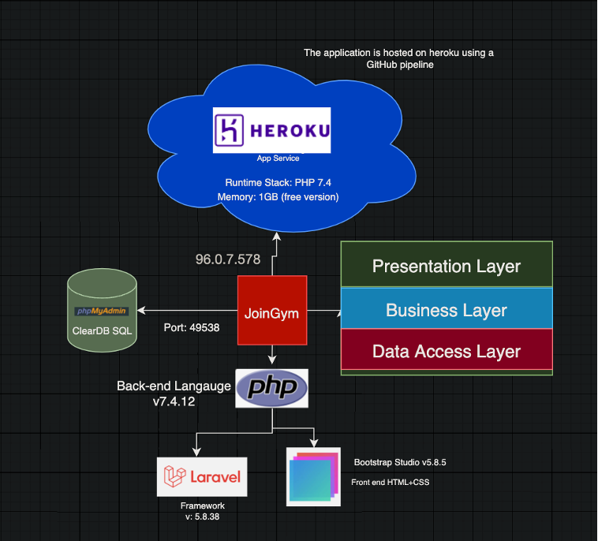
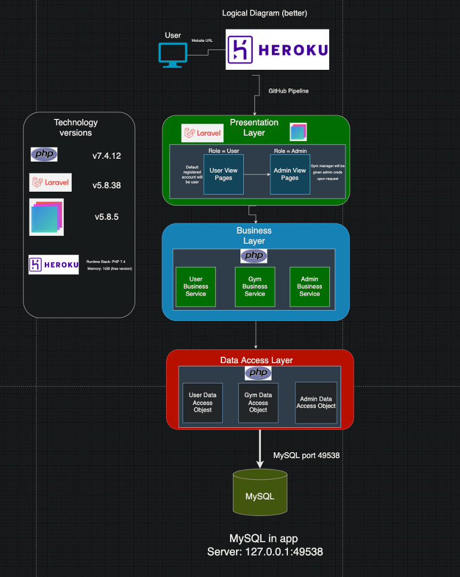

# This is the Repository for Austin Drivers' JoinGym project.

## This application is meant to connect fellow fitness enthusiast together in a casual way. 

***

### The gym can be an intimidating environment for new or introverted members. Some people, (like myself) found it hard to connect with other people at a gym because of the focused environment. Finding a gym partner with similar goals as me both skyrocketed my progress and overall enjoyment of the gym. **However, this took longer than I think it should have, so for my capstone project I wanted to begin building an application that can connect all fitness enthusiast of all types.**

***
___
***

# Requirements:
## Here are some of the functional requirements I set for JoinGym:
___
### 1. Each user will create a profile that can be accessed later

### 2. A user must create a profile specifying three important questions:

     a. Gym goals
     b. Gym or athletic experience
     c. Workout style preference (Alone or with others)

### 3. A user is able to view a variety of gyms and view the members of the gym they choose to join 

### 4. Once a user finds another member that has similar goals, they are able to exchange socials and choose to workout together. 

---


## Some non-functional requirements that I ensured would be present are:
___

### 1. A simple, yet satisfying front in that is easy to navigate
### 2. Fast loading times
### 3. Personalized profiles that are easy to edit 

***
___
***
# JoinGym is currently built utilizing PHP Laravel and Custom HTML+CSS which is connected to a relational database. 

    My goal was to get a functional foundation built that 
    I can then convert piece by piece over 
    to a more robust tec-stack (React-Native) 
    once my skills are more widely formed. 

### Object oriented programming (OOP) was paired with the Model, View, Controller (MVC) Architecture to have a balanced separation of concerns. This assisted in both the building and debugging process of creating the application.

``` ```
### JoinGym is currently not deployed to any cloud hosting services at this point. I am going to wait until a more robust version is developed before making the application available to a large group of members.  

***
___
***

# Project Diagrams: 

## High Level Design Diagram:



## Like any application, JoinGym is split into three different parts: Front end, Backend/Database, and cloud structure. Currently, JoinGym's front end is built using all custom HTML+CSS using various recourses. I wanted to build my end skills during this application and not relying on a front end framework helped me dive into raw HTML+CSS. 

## The backend of JoinGym was build using PHP Laravel. I knew that I could build a functional application using PHP Laravel, and I have had a good experience building full stack web applications utilizing Laravel. If I could go back and do it again, I would more than likely choose to build JoinGym using a more modern full stack framework such as React Native.


## JoinGym is currently not hosted. Getting an application hosted that is not yet ready for a mass amount of users to use seems like a major waste of time to me with this project. I would rather get a more robust version of the application built, tested and then hosted. Once hosting is a step I want to take, Heroku will be main first cloud hosting platform. I will implement hosting into JoinGym via a GitHub pipeline so I can have CI/CD functionality. The database will be used using ClearDB (An SQL service Heroku uses).

***

# Logical Diagram:



## The image above shows the high level logical flow of the application. We will start at the top and work our way down. 

## The user will access JoinGym through a cloud hosting provider (most likely Heroku) which will take them directly into the presentation layer of the application., The presentation layer consists of all user and admin pages. This pages are currently built using custom HTML+CSS and minor bootstrap tools such as buttons. 

## Buttons allow the user to interact with the business layer. For instance, the user will input their gym information, click submit, and this information is brought from the presentation layer, through the business layer, and placed into the MySql database. This separation allows for more security, and separation of concerns, allowing for better organized code. 

## When data is needed to be displayed on the presentation layer, the information is called through the data access object in the business layer and displayed on the presentation layer for the user to view. 

***
___
***

# What I learned:

## Before beginning on JoinGym, I had some hands on experience with PHP Laravel. I knew I could get a functional application built without having to dive into a new technology and risk not completing an application within one semester.

### The majority of my knowledge was on the front end of the application. I was initially wanting to utilize bootstrap or some other front end framework, but I opted to take a dive into raw HTML+CSS so I can have a well rounded knowledge of how it works before relying on a framework. 

### Because of the Agile-based structure of the 451 and 452 classes, I also learned a lot about project planning. Devoting an entire semester to researching, planning and implementation approach really gave me a strong sense of direction once it was time to start writing code. 
___

## Of course things changed along the way, but I truly believe that since I had such a structured plan in place, I made much farther progress than I would have if I had neglected the planning phase. 

***
___
***

# Risks and Challenges:

## For this capstone project my goal was to have as little risks as possible. Not passing this class meant not graduating on time, so I opted to take the safe route and stick with the familiar. Now this does not mean I didn't have risks or challenges, they were just manageable. My biggest 'risk' like most other students was the time crunch. building any full stack app can be a challenge, especially within one semester of college, while taking multiple other language classes. I was able to stay mostly on top on my tasks by writing out a task list specifically for JoinGym at the beginning of each week. I kept the project progression featured focused which allowed me to gauge my progress by how man features I had complete. 

***
___
***

# Outstanding issues:

## The only outstanding issue which was in scope was viewing individual gym profiles within specific sub-gyms. For whatever reason, I have had trouble getting th right information to display. I currently have a work around for this by manually entering users and then displaying their gym profiles. By doing this, it gives the feel that the application is functioning as planned until I get this issue figured out. I already have a plan on how to implement this in a different framework which I will be working towards shortly after graduation. 

### The only other 'Issue' would be having the application cloud hosted. Hosting JoinGymn in its current state seems redundant as I am not ready to have a mass amount of users use the site quite yet.


